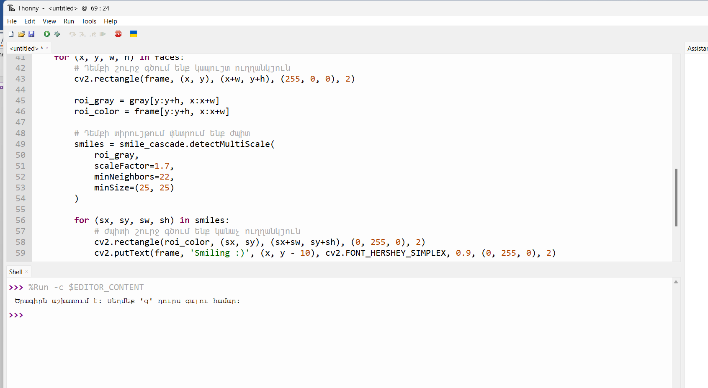

# Շաբաթ 3 — Ժպիտ հայտնաբերող ծրագիր AI - ների համեմատության համար

## 1. Ժպիտ հայտնաբերող ծրագիր՝ ստեղծված AI-ի միջոցով

Ծրագիրը գրվել է Python-ով՝ OpenCV գրադարանի Haar Cascade դասակարգիչների միջոցով, որոնք տեսախցիկից ստացվող տեսանյութում ճանաչում են դեմքը, ապա դեմքի տիրույթում՝ ժպիտը։ Ստորեւ ներկայացված է երկու տարբեր մոտեցում՝ Gemini-ով եւ Claude-ով ստեղծված տարբերակների տեսքով։

## 2. Ո՞րն է ավելի լավ ծրագրավորում

| Գործիք | Դիտարկումներ |
|---|---|
| **Gemini** | Կոդը տվեց արագ, բայց չկանխատեսեց միջավայրային խնդիրները (opencv-ի բացակայությունը, cascade ֆայլերի բացակայությունը)՝ ստիպելով քայլ առ քայլ շտկել 3 հաջորդական սխալ։ |
| **Claude** | Կոդում ի սկզբանե ներառեց սխալների կանխարգելում (ավտոմատ cascade ներբեռնում, ճշգրիտ տեղադրման հրահանգ), ինչը նվազեցրեց փորձարկման ընթացքում առաջացած խափանումները։ |
| **ChatGPT** | *(լրացվելու է)* |
| **DeepSeek** | *(լրացվելու է)* |
| **Copilot** | *(լրացվելու է)* |

**Եզրակացություն.** *(լրացրու)*

## 3. Ո՞րն է ավելի լավ սովորեցնում/բացատրում

| Գործիք | Դիտարկումներ |
|---|---|
| **Gemini** | Յուրաքանչյուր սխալի համար տվեց հակիրճ, տեխնիկական բացատրություն (պատճառ + լուծում), բայց չբացատրեց, թե ինչու է նույն խնդիրը կարող կրկնվել այլ մեքենայում։ |
| **Claude** | Փաստաթղթավորման ընթացքում ուղեկցեց կոդը մեկնաբանություններով եւ բացատրեց ընդհանուր տրամաբանությունը (երկփուլանի ճանաչում, cascade-երի ինքնաբեռնում)՝ ոչ միայն «ինչ անել», այլեւ «ինչու»։ |
| **ChatGPT** | *(լրացվելու է)* |
| **DeepSeek** | *(լրացվելու է)* |
| **Copilot** | *(լրացվելու է)* |

**Եզրակացություն.** *(լրացրու)*

## 4. Փաստաթղթավորում. ինչպես կառուցվեց ծրագիրը

### Փորձեցի Gemini AI-ն

Առաջադրանքը գրեցի Gemini-ին, եւ Gemini-ն ուղարկեց կոդը.

Կոդը գործարկեցի Thonny խմբագրիչում, որից հետո առաջացան սխալներ, որոնց սքրինշոթներն ուղարկում էի Gemini-ին։ Ահա մեր զրույցի համառոտ ընթացքը.

- Կոդը գործարկելիս առաջացավ առաջին սխալը՝ `ModuleNotFoundError: No module named 'cv2'`։
  Gemini-ն ասաց, որ OpenCV-ն տեղադրված չէ Thonny-ի Python միջավայրում, եւ առաջարկեց տեղադրել այն Tools → Manage packages... մենյուով կամ Terminal-ի միջոցով։

- Տեղադրումից հետո կոդը գործարկելիս առաջացավ երկրորդ սխալը՝ `AttributeError: module 'cv2' has no attribute 'CascadeClassifier'`։
  Gemini-ն ասաց, որ պատճառը opencv-ի ոչ լրիվ կամ անհամատեղելի տարբերակն է, եւ առաջարկեց վերատեղադրել կամ թարմացնել փաթեթը Terminal-ի միջոցով։

- Manage packages-ում որոնման տողում գրել էի «open cv python»՝ բացատներով. իրականում փաթեթը արդեն գտնվել եւ տեղադրվել էր, սակայն սքրինշոթն ուղարկելիս Gemini-ն սխալ մեկնաբանեց իրավիճակը եւ ասաց, որ բացատները պետք է հեռացնել եւ գրել ճիշտ անվանումը՝ opencv-python (գծիկով)։ Երբ որոնման տողում գրեցի գծիկով, տեսա, որ փաթեթն արդեն տեղադրված է։

- Տեղադրեցի opencv-python-ը (Installed version: 5.0.0.93), սակայն նույն սխալը կրկնվեց։
  Gemini-ն ասաց, որ OpenCV-ի 5.x տարբերակներում Haar Cascade-ի ուղիները փոխվել են, եւ առաջարկեց տեղադրել opencv-contrib-python կամ իջեցնել տարբերակը մինչեւ 4.10.0.84։

- Այդ տարբերակը տեղադրելուց հետո առաջացավ երրորդ սխալը՝ `[ERROR] Can't open file: ... haarcascade_frontalface_default.xml in read mode`։
  Gemini-ն ասաց, որ XML մոդելների ֆայլերը համակարգչում ֆիզիկապես բացակայում են, եւ այդ պատճառով փոխեց կոդը՝ ավելացնելով ավտոմատ ներբեռնման տրամաբանություն (`urllib`), որպեսզի ծրագիրն ինքնուրույն քաշի XML ֆայլերը GitHub-ից եւ աշխատի։

Ծրագիրն այնուհետեւ աշխատեց. տեսախցիկի պատուհանը բացվեց, եւ ժպիտը ճանաչվեց։

### Փորձեցի Claude AI-ն

Առաջադրանքը գրեցի Claude-ին, եւ Claude-ն ուղարկեց կոդը։ Կոդում Claude-ն ի սկզբանե ներառել էր Gemini-ի հետ արդեն հայտնաբերված երեք խնդիրների լուծումները՝ opencv-python-ի ճիշտ տեղադրման հրահանգ եւ Haar Cascade ֆայլերի ավտոմատ ստուգում/ներբեռնում GitHub-ի պաշտոնական պահոցից։ Այս պատճառով վերոնշյալ երեք սխալները չկրկնվեցին։ Կոդը Thonny-ում գործարկելիս սակայն առաջացավ նոր սխալ.

- Ես գործարկեցի կոդը Thonny-ում, բայց առաջացավ սխալ՝ `NameError: name '__file__' is not defined`։
  Claude-ն ասաց, որ պատճառը Thonny-ի «%Run -c» գործարկման եղանակն է, երբ կոդը կատարվում է որպես տեքստ, ոչ թե պահված ֆայլից, եւ այդ դեպքում `__file__` փոփոխականը սահմանված չէ։ Առաջարկեց ավելացնել `try/except` կառուցվածք, որը `__file__`-ի բացակայության դեպքում օգտագործում է ընթացիկ աշխատանքային թղթապանակը (`os.getcwd()`)։

Ծրագիրն այնուհետեւ աշխատեց. տեսախցիկի պատուհանը բացվեց, եւ ժպիտը ճանաչվեց։